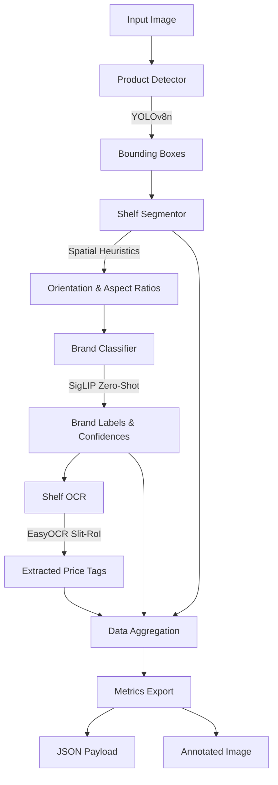

# Retail Shelf Analytics Pipeline

An end-to-end Machine Learning pipeline designed to analyze retail shelf images and extract business intelligence metrics, including On-Shelf Availability (OSA), Share of Shelf (SOS), Planogram Compliance, and Price Tag extraction.

## 🚀 Setup Instructions

### 1. Environment Setup
Ensure you have Python 3.9+ installed. Create and activate a virtual environment:

**Windows:**
```cmd
python -m venv venv
.\venv\Scripts\activate
```

**Linux / Mac:**
```bash
python3 -m venv venv
source venv/bin/activate
```

### 2. Install Dependencies
Install all required libraries, including PyTorch, Ultralytics (YOLO), HuggingFace Transformers, and EasyOCR.

```bash
pip install -r requirements.txt
```

### 3. Run the Pipeline
We have provided two ways to run the pipeline:

**A. Interactive Dashboard (Recommended)**
Launch the fully-featured Streamlit UI to visualize the bounding boxes, business metrics, and raw JSON outputs dynamically.
```bash
streamlit run app.py
```

**B. Command Line Interface (CLI)**
Process images directly from the terminal for backend integration.
```bash
# Process a single image
python pipeline.py --image "datasets/img_1.jpg"

# Batch process an entire directory
python pipeline.py --images_dir "datasets/"
```

---

## 🏗️ Architecture Diagram



---

## 📊 Output Example

For each processed image, the pipeline generates an annotated visual composite and a strict JSON payload containing the requested business metrics.

### Example JSON Payload:
```json
{
  "image_name": "shelf_01.jpg",
  "total_products": 42,
  "brands": {
    "Coca-Cola": 18,
    "Pepsi": 10,
    "Other": 14
  },
  "ocr_labels": [
    "20",
    "45",
    "62"
  ]
}
```
