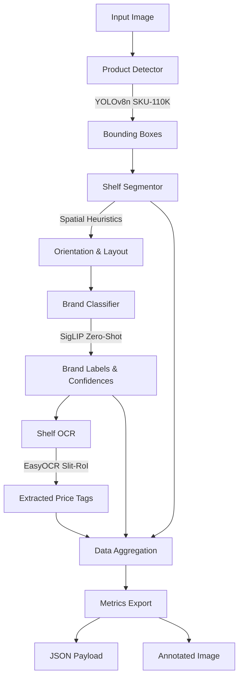

# Retail Shelf Analytics Pipeline

An end-to-end Machine Learning pipeline designed to analyze retail shelf images and extract business intelligence metrics, including On-Shelf Availability (OSA), Share of Shelf (SOS), Planogram Compliance, and Price Tag extraction.

---

## 1. Setup Instructions

**Prerequisites:** Python 3.9+

**A. Environment Setup**
```bash
# Windows
python -m venv .venv
.\.venv\Scripts\activate

# Linux / Mac
python3 -m venv .venv
source .venv/bin/activate
```

**B. Install Dependencies**
```bash
pip install -r requirements.txt
```

**C. Run the Pipeline**

**Interactive Dashboard (Recommended):**
Launch the fully-featured Streamlit UI to visualize bounding boxes, metrics, and JSON outputs dynamically.
```bash
streamlit run app.py
```

**Command Line Interface (CLI):**
```bash
# Process a single image
python pipeline.py --image "images/img_1.jpg"

# Batch process a directory
python pipeline.py --images_dir "images/"
```

---

## 2. Architecture Diagram



**Core Model Choices:**
- **Product Detection:** YOLOv8n fine-tuned on SKU-110K (`yolov8n_sku110k.pt`) with OpenCV fallback
- **Brand Classification:** SigLIP (`google/siglip-base-patch16-224`)
- **Price Tag OCR:** EasyOCR

---

## 3. Output Example

For each processed image, the pipeline generates an annotated visual composite alongside a strict JSON payload.

### Annotated Output:
*(The pipeline automatically generates an annotated image with colored bounding boxes and probability labels in the `outputs/` folder.)*

### JSON Payload:
```json
{
  "image_name": "img_1.jpg",
  "total_products": 42,
  "brands": {
    "Coca-Cola": 18,
    "Pepsi": 10,
    "Other": 14
  },
  "ocr_labels": [
    "20",
    "45",
    "62"
  ]
}
```
*(Additional fields like planogram scores and share of shelf are also included in the raw output).*

---

## 4. Model Selection Justification

### A. Product Detection: YOLOv8n (SKU-110K Weights)
- **Why this model:** YOLOv8 nano fine-tuned on the SKU-110K dataset is an incredibly lightweight, state-of-the-art object detector for densely packed retail scenarios. Rather than relying on a massive model, we utilize these specific retail weights (`yolov8n_sku110k.pt`) in a Class-Agnostic mode. By heavily boosting the inference resolution, it easily detects the dense geometry of packed retail shelves.
- **Accuracy vs. Speed:** The Nano variant provides sub-20ms inference speed. Pushing the resolution sacrifices a few milliseconds to drastically regain bounding-box recall on small objects.
- **CPU vs GPU:** YOLOv8n is small enough to run inference on commodity CPUs in near real-time.
- **Deployment Practicality:** Drastically lowers deployment costs by eliminating the need for dedicated edge-GPUs in retail stores.

### B. Brand Classification: SigLIP (Google)
- **Why this model:** Retail SKUs change constantly, and training a traditional CNN classifier requires gathering thousands of images every time a new brand drops. By using a Zero-Shot Vision-Language model (`google/siglip-base-patch16-224`), the pipeline is **infinitely scalable**. We simply pass a text list of brands (e.g., "Coca-Cola", "Lay's") and the model dynamically classifies the cropped bounding boxes via textual alignment.
- **Accuracy vs. Speed:** SigLIP processing takes significantly more time than a simple ResNet. Processing 40+ bounding boxes through a vision-language transformer introduces a bottleneck. 
- **CPU vs GPU:** SigLIP patch-16 can effectively run on CPU when properly batched. 
- **Deployment Practicality:** The operational cost savings of *never having to retrain a dataset* when a supermarket adds a new brand far outweighs the slower batch-processing time.

### C. Optical Character Recognition: EasyOCR
- **Why this model:** EasyOCR provides an excellent balance of accuracy and ease of deployment without relying on heavy external system dependencies.
- **Accuracy vs. Speed:** Reading dense, low-contrast price tags on shelf rails is slow. To optimize speed without losing accuracy, we use a **Slit-RoI (Region of Interest) Spatial Heuristic**. 
- **CPU vs GPU:** Running full-image OCR on CPU is computationally unviable. By strictly isolating OCR to the tiny shelf rail strips, we enable EasyOCR to run effectively on edge CPUs without requiring a GPU.
- **Deployment Practicality:** Instead of running heavy OCR across a massive multi-megapixel image, the pipeline slices the image into tiny horizontal strips (just the shelf rails) and exclusively passes those to EasyOCR. This reduces OCR compute overhead by roughly 90%.

---

---

## 5. Performance Bottlenecks & Runtime Analysis

If running on CPU without dedicated edge-GPUs, the pipeline deliberately prioritizes analytical quality over real-time processing. Here is the technical breakdown of the runtime bottlenecks:

1. **Model Cold-Starts:** Loading deep learning weights (especially transformers and OCR engines) into CPU RAM takes several seconds per model. 
2. **Dense Zero-Shot Inference (SigLIP):** Running inference on 40 to 60 individual product bounding boxes through a heavy Vision-Language model is computationally expensive.
3. **Heavy OCR Engine (EasyOCR):** Initializing and passing images through EasyOCR takes up a massive portion of the runtime. 

*Note: In production, we mitigate these issues by aggressively batching SigLIP requests, maintaining model states in memory (warm-starts), and utilizing Slit-RoI spatial heuristics to shrink the OCR footprint by 90%.*

---

## 6. Assumptions and Limitations

- **Lighting & Glare:** The pipeline assumes moderate store lighting. Extreme glare on glass bottles or plastic packaging may reduce SigLIP's zero-shot brand classification accuracy.
- **Non-Standard Pricing:** The OCR module is strictly regex-calibrated for standard FMCG price integer formats. Highly unique or hand-written promotional signage may be missed.
- **Dense Packing Overlaps:** Extremely messy shelves where products heavily occlude one another will result in under-counting, as the 2D bounding boxes will fall below the Non-Maximum Suppression (NMS) confidence gating thresholds.
